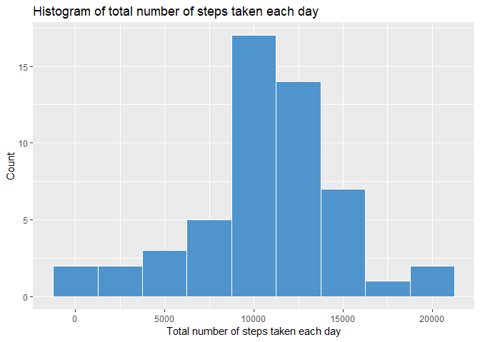
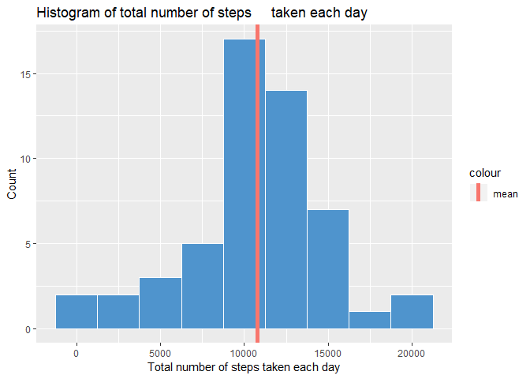
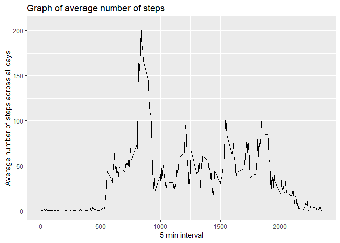
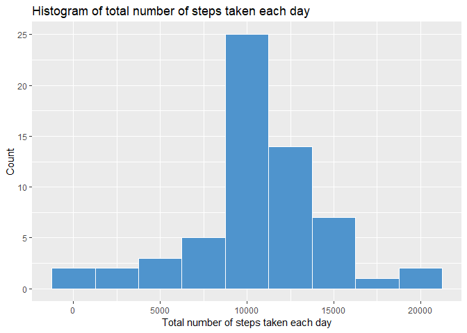
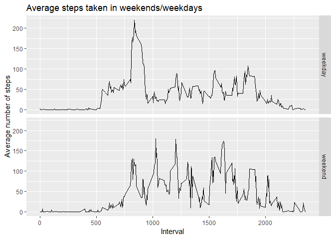

###Code for reading the dataset and processing the data


```r
library(dplyr)
library(ggplot2)

if(!file.exists("repdata%2Fdata%2Factivity.zip")) {
  temp <- tempfile()
  download.file("https://d396qusza40orc.cloudfront.net/repdata%2Fdata%2Factivity.zip",temp)
  data_file <- unzip(temp)
  unlink(temp)
}

activity <- read.csv("activity.csv")
```


###Histogram of the total number of steps taken each day


```r
activity_per_day <- activity %>%
  group_by(date) %>%
  summarise(total_steps = sum(steps))
activity_per_day$date <- as.Date(activity_per_day$date)
activity_per_day <- na.omit(activity_per_day)

ggplot(activity_per_day, aes(x = total_steps)) +
  geom_histogram(color = "white", fill = "steelblue3", binwidth = 2500) + 
  labs(x = "Total number of steps taken each day", y = "Count", title = "Histogram of total number of steps taken each day")
```

<!-- -->


###Mean and median number of steps taken each day


```r
mean_steps <- mean(activity_per_day$total_steps)
median_steps <- median(activity_per_day$total_steps)
```

__Mean__ = 1.0766189\times 10^{4}.
__Median__ = 10765.

Mean and median appeared to be almost the same, so let's visualize only mean on the histogram:


```r
ggplot(activity_per_day, aes(x = total_steps)) +
  geom_histogram(color = "white", fill = "steelblue3", binwidth = 2500) + 
  labs(x = "Total number of steps taken each day", y = "Count", title = "Histogram of total number of steps     taken each day") + 
  geom_vline(aes(xintercept = mean_steps, color = "mean"), show.legend = T, size = 2)
```

<!-- -->


###The average daily activity pattern


```r
activity_time_series <- na.omit(activity) %>%
  group_by(interval) %>%
  summarise(average_steps = mean(steps))

qplot(interval, average_steps, data = activity_time_series, geom = c("line")) + 
  labs(x = "5 min interval", y = "Average number of steps across all days", title = "Graph of average number of steps")
```

<!-- -->


###Imputing missing data

Replacing missing steps values with average on the specific 5 min interval:

```r
na_number <- nrow(activity) - nrow(na.omit(activity))

activity_imp <- activity
activity_imp$date <- as.Date(activity_imp$date)

for (i in 1:nrow(activity)){
  
  if(is.na(activity_imp$steps[i])){
    
    temp <- activity_imp$interval[i]
    activity_imp$steps[i] <- activity_time_series$average_steps[activity_time_series$interval == temp]
    
  }
}
```

Creating a histogram of the total number of steps taken each day:

```r
activity_per_day_imp <- activity_imp %>%
  group_by(date) %>%
  summarise(total_steps = sum(steps))

ggplot(activity_per_day_imp, aes(x = total_steps)) +
  geom_histogram(color = "white", fill = "steelblue3", binwidth = 2500) + 
  labs(x = "Total number of steps taken each day", y = "Count", title = "Histogram of total number of steps taken each day")
```

<!-- -->

Finding new mean and median values:

```r
mean_steps_new <- mean(activity_per_day_imp$total_steps)
median_steps_new <- median(activity_per_day_imp$total_steps)
```

__New Mean__ = 1.0766189\times 10^{4}.
__New Median__ = 1.0766189\times 10^{4}.

You can see the difference between old and new mean/median values is very small. That is why the impact of imputing missing data is really small too. Only median value has changed and new median is equal to the old one.


###Differences in activity patterns between weekdays and weekends

Preparing data:

```r
activity_imp$date <- weekdays(activity_imp$date)
activity_imp$day_type <- "---"

for(i in 1:nrow(activity_imp)){
  
  if (activity_imp$date[i] == c("Sunday", "Saturday")){
    
    activity_imp$day_type[i] <- "weekend"
    
  } 
  
  else {
    
    activity_imp$day_type[i] <- "weekday"
    
  }
}

activity_imp$day_type <- as.factor(activity_imp$day_type)
```

Making a plot of Average steps taken in Weekends/weekdays:

```r
activity_imp_plot <- activity_imp %>%
  group_by(interval, day_type) %>%
  summarise(average_steps = mean(steps))

qplot(interval, average_steps, data = activity_imp_plot, geom = "line",
      xlab = "Interval", ylab = "Average number of steps", facets = day_type ~.)+
  labs(title = "Average steps taken in weekends/weekdays")
```

<!-- -->


We can see people more active in the beggining of the weekday. Possibly it is because of moving to the workplace.

